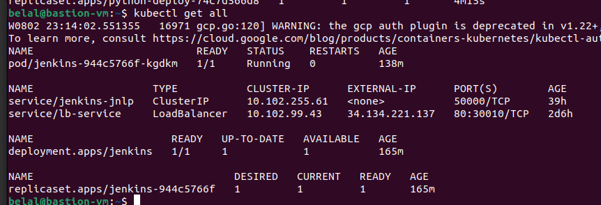
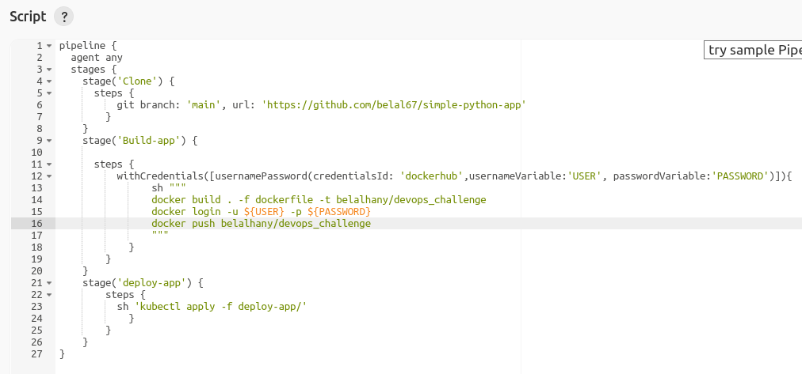
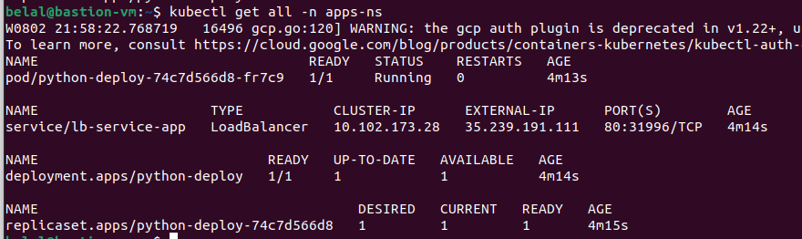
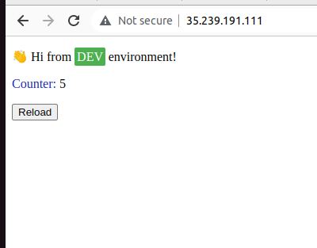

# Use Jenkins deployed in GKE Cluster to deploy application


# 1. infrastructure on GCP 
- Service-account
- VPC
- 2 private-subnets (management, restricted)
- nat
- cloud-router
- firewall (Allow ssh and http)
- vm instance (bastion host)
- GKE

in the folder terraform-code run these commands
```
terraform init 
terraform apply --var-file dev.tfvars
```

## you have to enable iap api to connect to your private instance (Bastion-vm) 

# 1. configration in Bastion instance
**ssh to bastion instance by running** \
`gcloud compute ssh --zone "us-central1-a" "bastion-vm"  --tunnel-through-iap --project "belal-357614"`

## install gcloud- and initialize gcloud
```
$ curl -O https://dl.google.com/dl/cloudsdk/channels/rapid/downloads/google-cloud-cli-394.0.0-linux-x86_64.tar.gz
$ tar -xf google-cloud-cli-394.0.0-linux-x86_64.tar.gz
$ ./google-cloud-sdk/install.sh
$ ./google-cloud-sdk/bin/gcloud init
# install gcloud packages and update repo
$ sudo apt-get install apt-transport-https ca-certificates gnupg
$ echo "deb [signed-by=/usr/share/keyrings/cloud.google.gpg] https://packages.cloud.google.com/apt cloud-sdk main" | sudo tee -a /etc/apt/sources.list.d/google-cloud-sdk.list
$ curl https://packages.cloud.google.com/apt/doc/apt-key.gpg | sudo apt-key --keyring /usr/share/keyrings/cloud.google.gpg add -
$ sudo apt-get update
$ sudo apt-get install google-cloud-sdk-gke-gcloud-auth-plugin

**install kubectl**
$ sudo apt-get install kubectl`

**install tinyproxy**

sudo apt-get -y install tinyproxy
sudo service tinyproxy start
```
**move kubernetes folder from local to bastion-vm** \
`gcloud compute scp ~/kubernetes bastion-vm:~`

## connect to  cluster from bastion 
`gcloud container clusters get-credentials private-cluster --region us-central1 --project belal-357614`

**test app by running `kubectl get all`**

# 1. Deploy jenkins to GKE

## create 2 namespaces
```
kubectl create ns jenkins-ns
kubectl create ns apps-ns
```
## Use jenkinsmaster to build image and push it to dockerhub
```
docker build . -f jenkinsmaster -t [yourrepo]:[your tag]
docker push [yourrepo]:[your tag]
```
or use it directly from `belalhany/jenkins-master`

**this image of jenkins is based on jenkins/jenkins:lts and has docker and kubernets installed**

##1. apply all yml files to create**
- Jenkins deployment
- Loadbalance for jenkins
- Service account for cluster
- PersistentVolumeClaim to save jenkins states and files
    - this automaticly will bound it to create persistentVolume in GKE
- ClusterIp service 
`kubectl apply -f ~/kubernetes` \



# 1. run jenkins pipeline using this code
  

 ## after build pipeline app deployment and loadbalancer service of [python app](https://github.com/belal67/simple-python-app) will be created 
   

 ## go to bastion and get app-loadbalancer external ip and paste it in browser 
 


